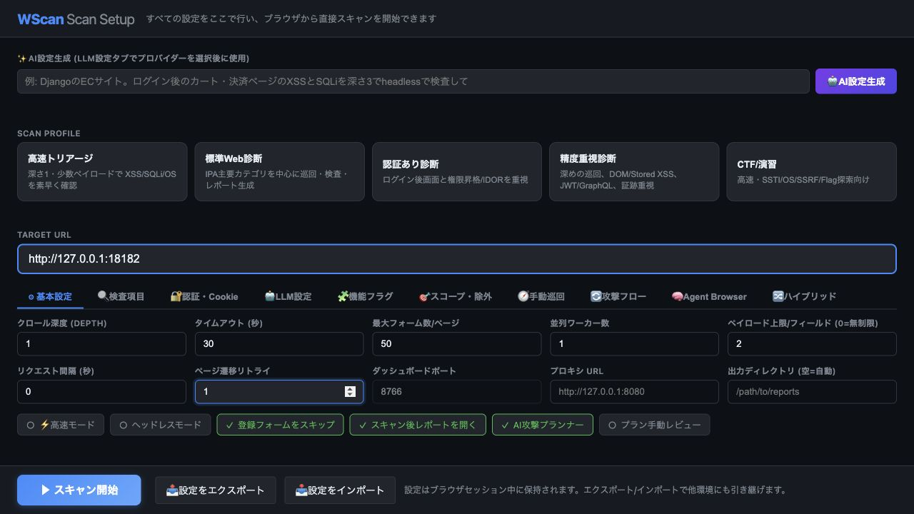
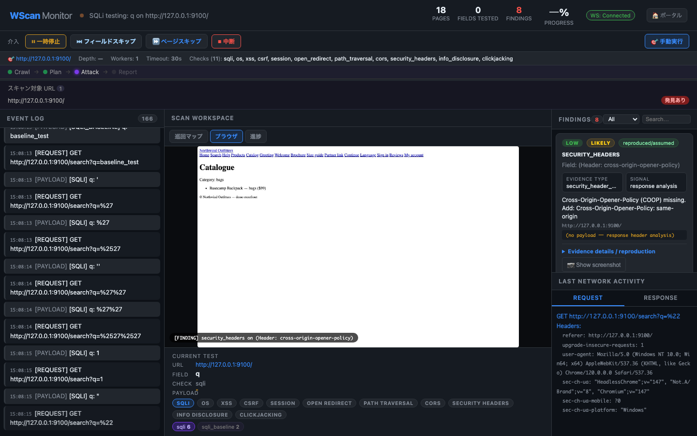

# WScan — Web Security Scanner

WScan は、IPA「**安全なウェブサイトの作り方**」の全脆弱性カテゴリに準拠した、Playwright ブラウザ自動化 × LLM 動的ペイロード生成による Web 脆弱性スキャナーです。

通常利用では、まずダッシュボードを起動し、ブラウザ上で検査対象 URL、認証情報、検査範囲、チェック種別を確認してからスキャンを開始する方法を推奨します。

```bash
python3 main.py serve --port 8765
```

ブラウザで `http://localhost:8765` を開き、Target URL を入力して `Scan Start` を押します。



検査が進むと、ダッシュボード上でクロール、攻撃計画、攻撃実行、レポート生成の進捗と Findings を確認できます。



詳しい画面操作は [docs/dashboard_usage_ja.md](docs/dashboard_usage_ja.md) を参照してください。

---

## ドキュメント

| ドキュメント | 内容 |
| --- | --- |
| [docs/dashboard_usage_ja.md](docs/dashboard_usage_ja.md) | ダッシュボードを先に起動し、画面から検査を開始する手順。疑似検査のスクリーンショット付き |
| [docs/server_deployment_ja.md](docs/server_deployment_ja.md) | サーバー常駐・イントラネット公開（トークン認証 / Docker / リバースプロキシ）の手順 |
| [docs/operation_guide_ja.md](docs/operation_guide_ja.md) | 実検査前の準備、認証、スコープ設計、検査強度、出力物、再検査の運用ガイド |
| [docs/troubleshooting_ja.md](docs/troubleshooting_ja.md) | アクセスできない、検査が途切れる、検出できない、UIに反映されない場合の切り分け |
| [docs/advanced_features.md](docs/advanced_features.md) | 高度診断支援機能の詳細 |
| [docs/oob_email_ja.md](docs/oob_email_ja.md) | OOB（帯域外）メール受信ボックスと MCP サーバの設定（blind XSS/SSRF・メールヘッダ注入の確証用） |

初めて使う場合は、この README の「クイックスタート」から始め、実際の操作は `dashboard_usage_ja.md`、現場投入前の確認は `operation_guide_ja.md`、問題発生時は `troubleshooting_ja.md` の順に確認してください。

---

## クイックスタート

### 1. インストール

```bash
git clone https://github.com/oudontabetai1-lab/AutoXSScheckTool.git
cd AutoXSScheckTool

pip install -r requirements.txt
playwright install chromium
```

**動作要件**: Python 3.11+、Playwright、FastAPI、Uvicorn、httpx、Rich、PyYAML、anthropic (Claude 使用時)

### 2. ダッシュボード起動

```bash
python3 main.py serve --port 8765
```

起動後、ブラウザで次を開きます。

```text
http://localhost:8765
```

ポートが競合する場合は、`--port 8766` のように別ポートを指定します。

#### サーバーに常駐させてイントラネットから使う場合

`serve` は常駐型のため、1 度起動すれば何度でもスキャンできます。社内ネットワークに
公開する場合は **アクセストークンを必ず設定**してください（未設定だと到達できる全員が
スキャナーを操作できます）。

```bash
export WSCAN_AUTH_TOKEN="$(openssl rand -hex 16)"   # トークンを生成・共有
python3 main.py serve --host 0.0.0.0 --port 8765 --no-open-browser
```

社内端末から `http://<サーバーのLAN IP>:8765` を開き、トークンでログインします。
Docker での配布やリバースプロキシ(HTTPS)構成は
[docs/server_deployment_ja.md](docs/server_deployment_ja.md) を参照してください。

```bash
# Docker でまとめて起動
export WSCAN_AUTH_TOKEN="$(openssl rand -hex 16)"
docker compose up -d --build
```

### 3. 画面から検査開始

1. `Target URL` に検査対象を入力する。
2. 目的に合うスキャンプロファイルを選ぶ。
3. 必要に応じて認証情報、Cookie、除外 URL、プロキシを設定する。
4. `Scan Start` を押す。
5. 攻撃プラン確認画面で対象フィールドとチェック種別を確認する。
6. `攻撃開始` を押す。
7. Findings、Event Log、Request / Response、`output/<timestamp>/report.html` を確認する。

疑似脆弱アプリでの実行例は [docs/dashboard_usage_ja.md](docs/dashboard_usage_ja.md) に画像付きでまとめています。

### 4. CLI で直接実行したい場合

ダッシュボードを経由せずに CLI から直接スキャンすることもできます。

```bash
python3 main.py scan https://example.com --checks xss sqli csrf --depth 2
```

高速確認では `--fast`、認証あり検査では `--cookie` / `--cookie-file` / `--login-url`、通信確認では `--proxy` を組み合わせます。

クライアント証明書が必要な mTLS 環境や、社内CA/自己署名証明書を使う環境では、証明書オプションを指定します。

```bash
python3 main.py scan https://secure.example.com \
  --tls-client-cert /path/to/client.crt \
  --tls-client-key /path/to/client.key \
  --tls-ca-cert /path/to/ca.pem \
  --tls-verify
```

PFX/PKCS#12 をブラウザアクセスに使う場合:

```bash
python3 main.py scan https://secure.example.com \
  --tls-client-pfx /path/to/client.p12 \
  --tls-client-cert-password 'password'
```

PEM の cert/key は Playwright と httpx の両方で使われます。PFX は Playwright ブラウザ向けです。`--tls-ca-cert` と `--tls-verify` は httpx の直接リクエストでサーバ証明書を検証するために使われ、ブラウザクロールは互換性維持のため HTTPS エラーを許容します。

## IPA 準拠カバレッジ

| IPA 章番号 | 脆弱性 | チェック名 | 手法 |
|-----------|--------|-----------|------|
| 1.1 | SQLインジェクション | `sqli` | エラーベース・ブールベース・時間ベース |
| 1.2 | OSコマンドインジェクション | `os` | 出力パターン検出・時間ベース |
| 1.3 | パス名パラメータ未チェック/ディレクトリトラバーサル | `path_traversal` | ファイル内容パターン検出 |
| 1.4 | セッション管理の不備 | `session` | Cookie 属性チェック (Secure/HttpOnly/SameSite) |
| 1.5 | クロスサイト・スクリプティング（反射型） | `xss` | ダイアログ確認・反射検出 |
| 1.5 | クロスサイト・スクリプティング（DOM型） | `dom_xss` | Playwright DOM シンクフック |
| 1.5 | クロスサイト・スクリプティング（格納型） | `stored_xss` | マーカー注入 → 全ページ横断検出 |
| 1.6 | CSRF | `csrf` | POST フォームの CSRF トークン有無 |
| 1.7 | HTTPヘッダ・インジェクション | `header_injection` | CRLF 注入 → レスポンスヘッダ確認 |
| 1.8 | メールヘッダ・インジェクション | `mail_header` | ⚠️ 無効化済み（確証に OOB メール受信が必要で黒box では実用的に検知できないため。実装は残置） |
| 1.9 | クリックジャッキング | `clickjacking` | X-Frame-Options / CSP frame-ancestors 確認 |
| 1.11 | オープンリダイレクト | `open_redirect` | リダイレクト先未検証の検出 |
| — | アクセス制御・権限昇格 | `privesc` | 未認証アクセス・垂直/水平権限昇格 (IDOR)・401/403 バイパス |
| — | CORS 設定ミス | `cors` | ワイルドカード ACAO・任意 Origin 反射 |
| — | 機密ファイル露出・情報漏洩 | `info_disclosure` | `.env`・`.git`・phpinfo 等へのアクセス確認 |
| — | Host ヘッダインジェクション | `host_header` | パスワードリセット汚染 |
| — | セキュリティヘッダ監査 | `security_headers` | HSTS・CSP・X-Content-Type-Options 等 |
| — | ファイルアップロード脆弱性 | `file_upload` | Webシェル・二重拡張子・Content-Type 偽装 |
| — | NoSQL インジェクション | `nosql` | MongoDB オペレータ注入 (`$ne`, `$gt`, `$regex`) |
| — | 安全でないデシリアライズ | `deserialization` | PHP/Java/Python pickle プローブ |
| — | HTTP リクエストスマグリング | `request_smuggling` | CL.TE / TE.CL / TE.TE タイミング検出 |
| — | SSTI (オプション) | `ssti` | テンプレートエンジン数式評価確認 |
| — | GraphQL 脆弱性（イントロスペクション / インジェクション） | `graphql` | スキーマ列挙・フィールドインジェクション・バッチクエリ |
| — | JWT 脆弱性（署名なし / 弱シークレット / kid インジェクション） | `jwt` | alg:none 攻撃・HMAC ブルートフォース・ペイロード改ざん |
| — | シークレット / API キー漏洩 | `secret_leak` | レスポンスボディ内のクラウド/SaaS トークン・秘密鍵を高精度パターン + エントロピー検査で検出 |
| — | Subresource Integrity (SRI) 不備 | `sri` | サードパーティ `<script>` / `<link>` の `integrity` 属性欠如を検出（サプライチェーン保護） |

---

## 主な機能

### スキャン精度・カバレッジ

- **AI 攻撃計画（AttackPlanner）** — スキャン前にページを分析し、フィールドごとに優先チェックとターゲット特化ペイロードを計画
- **DOM-based XSS 検出** — `innerHTML` / `document.write` / `eval` / `location.href` 等の危険シンクを Playwright でフック、クライアントサイド実行を検出
- **格納型 XSS 検出** — ユニークマーカーを注入し、全クロールページを横断してペイロードの出現を確認
- **アクセス制御検査** — 未認証アクセス・垂直権限昇格（低権限セッション）・水平権限昇格 (IDOR) に加え、**401/403 アクセス制御バイパス**（パス正規化・信頼 IP ヘッダ偽装・URL リライトヘッダ・HTTP メソッド改ざん）を検出
- **CORS 検出** — ワイルドカード ACAO・任意 Origin 反射・クレデンシャル付き CORS を自動判定
- **機密ファイル露出** — `.env`・`.git`・phpinfo・actuator 等 35 種以上のパスをプローブ
- **セキュリティヘッダ監査** — HSTS・CSP・X-Content-Type-Options・Referrer-Policy・Permissions-Policy の欠如/設定ミスを検出
- **ファイルアップロード検査** — PHP/JSP/ASPX Webシェル・二重拡張子・Content-Type 偽装を試行
- **NoSQL インジェクション** — MongoDB `$ne`/`$gt`/`$regex` オペレータ注入・JSON ボディ注入
- **安全でないデシリアライズ検出** — PHP/Java/Python pickle/YAML プローブでエラーパターンを検出
- **HTTP リクエストスマグリング** — CL.TE / TE.CL / TE.TE(難読化) をタイミング差で検出
- **Host ヘッダインジェクション** — パスワードリセット汚染シナリオを自動テスト
- **GraphQL セキュリティテスト** — `/graphql` 等 8 種のエンドポイントを自動探索。イントロスペクション公開・バッチクエリによるレート制限回避・フィールドへの XSS/SQLi/SSTI インジェクション・スキーマ内機密情報（パスワード・トークン等フィールド名）を検出
- **JWT 脆弱性スキャン** — Cookie・Authorization ヘッダ・URL パラメータから JWT を自動検出。`alg:none` 攻撃・弱シークレット（60+ 種ブルートフォース）・`kid` パラメータ SQLi/パストラバーサル・ペイロード改ざん・期限なし JWT・JWT 内 PII 漏洩を検出
- **パラメータ IDOR 検出** — クエリパラメータ/POST ボディの `user_id`・`order_id`・`id` 等の数値を ±1 変化、UUID 末尾変更でアクセス試行し、他ユーザーのリソース露出を検出
- **複数アカウント権限昇格** — `--accounts` で複数アカウントを一括指定、または `--auto-register` で登録フォームを自動検出してテストアカウントを作成。アカウント間でのリソース横断アクセス（IDOR）・垂直権限昇格を自動検証
- **フィールドレベル検査**と**ページレベル検査**の 2 層構造

### AI / 自動化強化

- **WAF 自動検出** — スキャン前にプローブを送り Cloudflare / AWS WAF / ModSecurity 等を判定。LLM がバイパス戦略を提案
- **ペイロード継続学習（ドメイン別）** — 成功・失敗ペイロードをグローバル + ドメイン別に JSON 記録し、同一ターゲットへの再スキャン時にドメイン固有の成功ペイロードを 2 倍の重みで優先使用
- **脆弱性チェーン推論** — 全 Finding を LLM に渡し、多段攻撃シナリオ（最大 3 チェーン）を推論。各チェーンにステップ・使用脆弱性・最終的なビジネス影響を含む
- **Finding 別 AI 修正提案** — Critical/High の各 Finding に対し LLM がビジネス影響（非技術者向け）・修正コード例・OWASP/CWE 参照を生成し HTML レポートに組み込む
- **スキャン後 AI 総合分析** — 全 Finding を LLM に渡し、攻撃シナリオ・優先修正順位・推奨 WAF ルールを自然言語レポートとして生成
- **自動設定ウィザード** (`--auto-config`) — ターゲットの説明・禁止事項・必須チェックを入力すると LLM が最適なスキャン設定を生成しレビュー後に適用

### クロール・対象拡大

- **SPA クロール強化** — `--spa-crawl` で React/Vue/Angular SPA の動的ルートを収集。`history.pushState` フック + クリック操作で通常クローラーが見逃すページを発見
- **BFS クローラー** — 設定可能な深さで同一ドメインリンクを自動収集
- **sitemap.xml / robots.txt 活用** — クロール時に自動取得して未リンクページを発見
- **ログイン自動化** — `--login-url` でログインフォームを自動入力してセッションを取得

### レポート・出力

- **CVSS 3.1 スコア自動計算** — Finding ごとにベクタ文字列とスコアを付与、優先度ソートに利用
- **自己完結型 HTML レポート** — 証拠スクリーンショット・HTTP リクエスト/レスポンスつき

### UI / 操作性

- **リアルタイム監視ダッシュボード** — WebSocket 経由でペイロード・検出結果・スクリーンショットをライブ表示
- **Finding フィルタ・検索** — 重要度・スキャナ種別・URL・フィールド名でリアルタイムフィルタリング
- **手動ペイロード実行** — ダッシュボードから任意のフィールドにペイロードを即座に送信

### CI/CD・運用

- **プロキシ対応** (`--proxy`) — Burp Suite / mitmproxy 経由でのスキャン
- **設定ファイル** (`config/wscan.yaml`) — 全デフォルト値を YAML で管理。CLI フラグで上書き可能

---

## インストール

基本手順は「クイックスタート」と同じです。

```bash
git clone https://github.com/oudontabetai1-lab/AutoXSScheckTool.git
cd AutoXSScheckTool
pip install -r requirements.txt
playwright install chromium
```

LLM を使う場合は、利用するプロバイダーに応じて API キーやローカルモデルを準備します。LLM を使わずに固定ペイロード中心で確認する場合は、`--llm none` またはダッシュボードの LLM 設定で無効化して実行できます。

---

## 使い方

### 推奨: ダッシュボードから開始

```bash
python3 main.py serve --port 8765
```

`http://localhost:8765` を開き、画面から Target URL、プロファイル、認証、スコープ、チェック種別を設定します。操作手順は [docs/dashboard_usage_ja.md](docs/dashboard_usage_ja.md) を参照してください。

ダッシュボード起点の運用では、検査前に対象範囲を確認し、攻撃プラン確認画面で実行内容を見てから攻撃フェーズに進めるため、実検査での誤爆や過剰なリクエストを抑えやすくなります。

### トリアージモード（ペイロード送信なし・高速リスク評価）

```bash
# ペイロードを一切送らずにページ構造・ヘッダを解析し、リスクと推奨ペイロードを表示
python main.py triage https://example.com

# LLM を使った AI 攻撃戦略アドバイスつき
python main.py triage https://example.com --llm ollama --depth 2

# JSON ファイルに保存
python main.py triage https://example.com --output triage.json
```

出力例:
```
╭─ WScan Triage Report ─────────────────────────╮
│ Target: https://example.com                    │
│ Fields analysed: 12   Pages visited: 5         │
╰────────────────────────────────────────────────╯
┌──────────┬──────────┬──────┬───────┬──────────────────────────────────────┐
│ URL      │ Field    │ Type │ Risk  │ Recommended Payloads (top 2)         │
├──────────┼──────────┼──────┼───────┼──────────────────────────────────────┤
│ /login   │ username │ text │ ●HIGH │ [sqli] ' OR '1'='1'--               │
│          │          │      │       │ [xss] <script>alert(document.domain) │
│ /search  │ q        │ text │ ●HIGH │ [xss]   │
│ /        │ (header) │  —   │ ●MED  │ Clickjacking: X-Frame-Options missing│
└──────────┴──────────┴──────┴───────┴──────────────────────────────────────┘
Suggested full scan command:
  python main.py scan https://example.com --checks sqli xss ssti os nosql cors
```

### 基本スキャン

```bash
python main.py scan https://example.com
```

### チェック種類を絞る

```bash
python main.py scan https://example.com --checks xss sqli csrf clickjacking
```

### ヘッドレス + Claude LLM + プロキシ

```bash
python main.py scan https://example.com --headless --llm claude --proxy http://127.0.0.1:8080
```

### 自動設定ウィザード（LLM がスキャン設定を提案・適用）

```bash
python main.py scan https://example.com --auto-config --llm ollama
```

### ログイン自動化 + 権限昇格テスト

```bash
# ログインフォームを自動入力してセッションを取得
python main.py scan https://example.com \
  --login-url https://example.com/login \
  --auth-user admin --auth-pass p@ssw0rd

# 低権限セッションも渡して垂直権限昇格テスト
python main.py scan https://example.com \
  --cookie "session=highpriv_token" \
  --low-priv-cookies "session=lowpriv_token"
```

### DOM-based XSS 検出を有効化

```bash
python main.py scan https://example.com --dom-xss
```

### CTF モード（高速スキャン + SSTI 追加）

```bash
python main.py scan https://example.com --ctf --headless --no-monitor
```

### 特定パラメーターを除外

```bash
python main.py scan https://example.com --exclude csrf_token __RequestVerificationToken
```

### GraphQL + JWT スキャン

```bash
python main.py scan https://example.com --checks graphql jwt
```

### 複数アカウント権限昇格テスト（手動指定）

```bash
python main.py scan https://example.com \
  --checks privesc \
  --accounts "admin:admin123,user1:pass1" \
  --login-url https://example.com/login
```

### 自動アカウント登録 + 権限昇格テスト

```bash
# 登録フォームを自動検出し、テストアカウントを 2 つ自動作成して権限昇格テストを実行
python main.py scan https://example.com \
  --checks privesc \
  --auto-register --auto-register-count 2 \
  --login-url https://example.com/login
```

### SPA クロール（React/Vue/Angular 対応）

```bash
# history.pushState フック + クリック操作で動的ルートを収集
python main.py scan https://example.com --spa-crawl --depth 3
```

### 全機能込みスキャン

```bash
python main.py scan https://example.com \
  --checks sqli xss privesc graphql jwt \
  --accounts "admin:pass1,user:pass2" \
  --spa-crawl --llm claude --headless
```

### 自然言語でスキャン設定を確認（setupコマンド）

```bash
python main.py setup "ECサイトで管理画面あり、RESTful APIも使用"
```

---

## コマンドラインオプション一覧

```
usage: main.py scan [オプション] URL

位置引数:
  url                      スキャン対象 URL

主要オプション:
  --checks CHECK ...       実行するチェック (デフォルト: config/wscan.yaml)
                           選択肢: sqli xss dom_xss stored_xss os path_traversal
                                   session csrf header_injection
                                   clickjacking open_redirect ssti privesc
                                   cors info_disclosure host_header security_headers
                                   file_upload nosql deserialization request_smuggling
                                   ssrf graphql jwt cms xxe ldap race_condition
                                   websocket secret_leak sri
  --depth N                クロール深度 (デフォルト: 2)
  --headless               ブラウザをヘッドレスモードで起動
  --no-monitor             リアルタイム監視ダッシュボードを無効化
  --llm PROVIDER           LLM プロバイダー: ollama|claude|openai|gemini|none
  --ollama-model MODEL     Ollama モデル名 (デフォルト: llama3)
  --openai-model MODEL     OpenAI モデル名 (デフォルト: gpt-4o-mini)
  --gemini-model MODEL     Google Gemini モデル名 (デフォルト: gemini-2.0-flash)
  --payloads FILE          カスタムペイロード YAML ファイル
  --output DIR             出力ディレクトリ (デフォルト: output/<タイムスタンプ>)
  --port PORT              監視ダッシュボードポート (デフォルト: 8765)
  --timeout SECS           リクエストタイムアウト秒数 (デフォルト: 30)
  --max-forms N            1 ページあたり最大フォーム数 (デフォルト: 50)
  --exclude PARAM ...      スキップするパラメーター名
  --exclude-file FILE      除外パラメーター一覧ファイル
  --exclude-urls-file FILE スキップする URL プレフィックス一覧ファイル
  --ctf                    CTF モード: SSTI 追加・遅延半減
  --ctf-flag-format REGEX  フラグ検出の正規表現パターン

認証・セッション:
  --cookie COOKIES         スキャン前にセットする Cookie 文字列
  --cookie-file FILE       ブラウザエクスポートの Cookie JSON ファイル
  --auth-user USER         ログインフォーム自動入力ユーザー名
  --auth-pass PASS         ログインフォーム自動入力パスワード
  --login-url URL          自動ログイン対象のログインページ URL
  --login-user-field NAME  ユーザー名フィールド名 (デフォルト: username)
  --login-pass-field NAME  パスワードフィールド名 (デフォルト: password)
  --login-success TEXT     ログイン成功判定のURL/ページ内文字列
  --low-priv-cookies STR   垂直権限昇格テスト用の低権限セッション Cookie
  --low-priv-cookie-file F 低権限セッション Cookie JSON ファイル
  --include-registration   登録/サインアップフォームもテスト対象に含める
  --accounts USER:PASS,... 複数アカウントをカンマ区切りで指定（権限昇格テスト用）
                           例: "admin:admin123,user1:pass1"
  --accounts-file FILE     アカウント一覧 YAML ファイル
  --auto-register          登録フォームを自動検出してテストアカウントを作成
  --auto-register-count N  自動作成するアカウント数 (デフォルト: 2)

機能 On/Off:
  --dom-xss                DOM-based XSS 検出を有効化
  --spa-crawl              SPA の動的ルートをクリック操作で収集（React/Vue/Angular 対応）
  --auto-config            LLM 設定ウィザードを起動してスキャン設定を自動生成
  --no-auto-config         設定ウィザードを無効化 (デフォルト)
  --no-ai-analysis         スキャン後 AI 総合分析レポートを無効化
  --no-waf-detection       WAF 自動検出を無効化
  --no-payload-learning    ペイロード継続学習を無効化
  --no-sitemap-crawl       sitemap.xml / robots.txt クロールを無効化
  --no-planner             AI 攻撃計画機能を無効化
  --no-open-report         スキャン完了後のレポート自動表示を無効化

プロキシ・通信:
  --proxy URL              HTTP プロキシ URL (例: http://127.0.0.1:8080)
  --tls-client-cert FILE   mTLS 用 PEM クライアント証明書
  --tls-client-key FILE    --tls-client-cert に対応する PEM 秘密鍵
  --tls-client-pfx FILE    Playwright ブラウザアクセス用 PFX/PKCS#12 証明書
  --tls-client-cert-password TEXT
                           クライアント証明書キーまたは PFX のパスフレーズ
  --tls-ca-cert FILE       サーバ証明書検証に使う CA バンドル
  --tls-verify             サーバ証明書を検証する
  -H "Name: Value"         全リクエストに付与するカスタムヘッダ。複数指定可
  --header-file FILE       JSON / YAML / Name: Value 形式のヘッダファイル
  --har FILE               HAR から URL と Cookie を取り込む
  --manual-crawl FILE      手動巡回 JSON から URL と Cookie を取り込む
  --previous-scan DIR      前回 evidence.json と比較して新規/修正/継続 Finding を表示
  --concurrency N          攻撃フェーズの並列ブラウザワーカー数
  --fast                   高速スキャンモード
  --max-payloads N         フィールド・チェックタイプごとのペイロード上限
  --delay SECS             リクエスト間隔
  --navigation-retries N   ページ遷移失敗時の再試行回数

学習データ:
  --learning-file FILE     ペイロード学習データ JSON ファイル
                           (デフォルト: config/payload_learning.json)
```

---

## 設定ファイル (`config/wscan.yaml`)

CLI フラグを毎回指定せずにデフォルト値を管理できます。

```yaml
scan:
  checks: [sqli, xss, os]
  depth: 2
  max_forms: 50
  timeout: 30

browser:
  headless: false
  proxy: ""

llm:
  provider: ollama
  ollama_model: llama3

features:
  dom_xss: false
  ai_analysis: true
  waf_detection: true
  payload_learning: true
  sitemap_crawl: true
  spa_crawl: false         # --spa-crawl のデフォルト
  auto_config: false       # --auto-config のデフォルト
  open_report: true

accounts:
  auto_register: false     # --auto-register のデフォルト
  auto_register_count: 2   # 自動作成アカウント数
  list: []                 # 事前定義アカウントリスト
```

---

## 出力ファイル

```
output/
└── 20240101_120000/
    ├── report.html             # 自己完結型 HTML レポート（ブラウザで開く）
    ├── report_executive.html   # 経営・管理層向けサマリーレポート
    ├── report_developer.html   # 開発者向け修正観点レポート
    ├── report.sarif            # SARIF 2.1.0 レポート
    ├── evidence.json           # 全検出結果 JSON
    ├── reproduction.json       # 再現に必要なリクエスト/条件
    ├── reproduce.sh            # 再現用シェルスクリプト
    ├── scan_config.json        # 実行時設定のスナップショット
    ├── remediation_plan.md     # 修正方針・対応タスク
    ├── remediation_tasks.json  # 機械処理しやすい修正タスク
    ├── ai_analysis.md          # AI 攻撃チェーン分析・総合レポート（Markdown）
    ├── ai_finding_fixes.json   # Finding 別 AI 修正提案（ビジネス影響・修正コード・CWE 参照）
    ├── http_requests.jsonl     # 送信した全 HTTP リクエスト/レスポンスの監査ログ（1行1JSON）
    ├── payloads.jsonl          # 投入したペイロードのログ（--no-monitor/バッチでも常時。1行1JSON）
    └── screenshots/            # スキャン中スクリーンショット

config/
└── payload_learning.json    # ペイロード学習データ（グローバル + ドメイン別、累積）
```

出力物の読み方、Evidence の確認順、再検査時の比較方法は [docs/operation_guide_ja.md](docs/operation_guide_ja.md) を参照してください。

### 深刻度と CVSS スコアの目安

| 深刻度 | CVSS スコア | 主な例 |
|--------|------------|-------|
| **Critical** | 9.0+ | JS ダイアログ発火 XSS・SSTI・SQLi・垂直権限昇格 |
| **High** | 7.0–8.9 | 反射 XSS・ブールベース SQLi・ディレクトリトラバーサル・水平権限昇格 (IDOR) |
| **Medium** | 4.0–6.9 | CSRF・クリックジャッキング・セッション Cookie 属性不備・オープンリダイレクト |
| **Low/Info** | < 4.0 | その他軽微な設定ミス |

---

## 自動設定ウィザード (`--auto-config`)

`--auto-config` を付けて起動すると、スキャン開始前に 3 ステップのインタビューが実行されます。

```
[ステップ 1] ターゲットの説明
  例: 「ECサイト。管理画面あり。Vue.js 製 SPA で REST API を使用」

[ステップ 2] 禁止事項
  例: 「ログアウト・パスワード変更・購入フォームへの実送信は禁止」

[ステップ 3] 必須チェック
  例: 「SQLインジェクションとXSSは必ず確認。認証系も優先して」

         ↓ LLM が JSON 設定を生成

[設定レビュー] リッチテーブルで表示 → 承認 / 編集 / キャンセル

         ↓ 承認すると args に自動適用してスキャン開始
```

---

## カスタムペイロード

`config/default_payloads.yaml` をコピーして編集し、`--payloads` で指定します。

```yaml
xss:
  - "<script>alert('custom')</script>"

path_traversal:
  - "../../../../etc/shadow"
```

---

## ペイロード継続学習 (A-3 / ⑩)

スキャンを重ねるごとに成功ペイロードが `config/payload_learning.json` に記録され、
次回スキャン時に成功率の高いペイロードが優先使用されます。

バージョン 2 からはドメイン別学習をサポート。同一ターゲットへの再スキャン時は
`domains[hostname]` の成功率を 2 倍の重みで優先します。

```json
{
  "global": {
    "xss": {
      "": {"hits": 4, "tries": 5},
      "<script>alert(1)</script>":    {"hits": 1, "tries": 5}
    }
  },
  "domains": {
    "example.com": {
      "xss": {
        "<svg onload=alert(1)>": {"hits": 3, "tries": 3}
      }
    }
  }
}
```

---

## アーキテクチャ

```
main.py
    ├── run_scan()    → ScanEngine
    ├── run_triage()  → TriageEngine  ← NEW
    └── run_setup()   → 自然言語設定アシスタント

wscan/
    ├── engine.py              # スキャン全体の制御・フェーズ管理
    ├── triage.py              # トリアージモード (ペイロードなし高速評価) ← NEW
    ├── browser.py             # Playwright 操作・ログイン自動化
    ├── attack_planner.py      # AI 攻撃計画 (AttackPlanner)
    ├── payload_gen.py         # LLM / デフォルトペイロード生成
    ├── payload_learning.py    # ペイロード継続学習 (A-3)
    ├── waf_detector.py        # WAF 検出・バイパス提案 (A-2)
    ├── auto_config.py         # 自動設定ウィザード
    ├── monitor.py             # WebSocket リアルタイムダッシュボード
    ├── report.py              # HTML レポート生成 (CVSS バッジ・フィルター)
    └── scanners/
            ├── base.py                    # Finding・CVSS テーブル・基底クラス
            ├── xss.py                     # IPA 1.5 反射型 XSS
            ├── dom_xss.py                 # IPA 1.5 DOM-based XSS
            ├── stored_xss.py              # IPA 1.5 格納型 XSS ← NEW
            ├── sqli.py                    # IPA 1.1 SQLi
            ├── os_injection.py            # IPA 1.2 OSコマンドインジェクション
            ├── path_traversal.py          # IPA 1.3 ディレクトリトラバーサル
            ├── session.py                 # IPA 1.4 セッション管理
            ├── csrf.py                    # IPA 1.6 CSRF
            ├── header_injection.py        # IPA 1.7 HTTPヘッダインジェクション
            ├── mail_header.py             # IPA 1.8 メールヘッダインジェクション
            ├── clickjacking.py            # IPA 1.9 クリックジャッキング
            ├── open_redirect.py           # IPA 1.11 オープンリダイレクト
            ├── ssti.py                    # SSTI (オプション)
            ├── privesc.py                 # 認証・権限昇格
            ├── cors.py                    # CORS 設定ミス ← NEW
            ├── info_disclosure.py         # 機密ファイル露出・情報漏洩 ← NEW
            ├── host_header.py             # Hostヘッダインジェクション ← NEW
            ├── security_headers.py        # セキュリティヘッダ監査 ← NEW
            ├── file_upload.py             # ファイルアップロード脆弱性 ← NEW
            ├── nosql_injection.py         # NoSQLインジェクション ← NEW
            ├── deserialization.py         # 安全でないデシリアライズ ← NEW
            ├── request_smuggling.py       # HTTPリクエストスマグリング ← NEW
            ├── graphql.py                 # GraphQL イントロスペクション・インジェクション ← NEW
            └── jwt_scanner.py             # JWT 脆弱性 (alg:none/弱シークレット/kid injection) ← NEW
```

---

## 検知ロジック詳細

### XSS — 反射型 (IPA 1.5)
1. **ダイアログ確認 (Critical)**: `alert()` ダイアログ発火を Playwright で確認
2. **反射確認 (High)**: レスポンス HTML 内の未エンコードマーカーを検出

### XSS — DOM-based (IPA 1.5)
- ページロード時に `innerHTML`・`outerHTML`・`document.write`・`eval`・`setTimeout`・`location.href`・`insertAdjacentHTML` をフック
- ペイロード固有マーカーが DOM シンクを経由した場合のみ Critical で報告

### SQLi (IPA 1.1)
1. **エラーベース (Critical)**: DB エラーメッセージのパターン照合
2. **ブールベース (High)**: 真条件 vs 偽条件のレスポンス長差異で判定
3. **時間ベース (High)**: `SLEEP(3)` 投入後 ≥2.5 秒の遅延

### アクセス制御・権限昇格 (`privesc`)
1. **未認証アクセス (High/Medium)**: Cookie なしで管理系パスが HTTP 200 を返す場合
2. **垂直権限昇格 (Critical)**: 低権限セッションで高権限リソースにアクセス可能
3. **水平権限昇格 / IDOR (High)**: URL パスの数値 ID を ±1/±5 変化させ他ユーザーのリソースが取得できるか確認
4. **パラメータ IDOR (High)**: クエリパラメータ/POST ボディ内の `user_id`・`order_id`・`id` 等を ±1 変化、UUID 末尾変更でテスト
5. **複数アカウント間 IDOR (High)**: アカウント A のリソース URL にアカウント B のセッションでアクセスし、コンテンツ差異を検出
6. **状態変更操作の認可欠落 (High)**: 管理系の非 GET フォームを低権限セッションで送信し、サーバー側認可が無いか確認
7. **401/403 アクセス制御バイパス (High)**: 保護パスが 401/403 を返す場合に、以下のバイパス手法を試行
   - **パス正規化**: `/admin/`・`/admin/.`・`/admin//`・`/admin/..;/`・`/admin%20`・大文字化・`.json`/`.html` 付与 など
   - **信頼 IP ヘッダ偽装**: `X-Forwarded-For: 127.0.0.1`・`X-Custom-IP-Authorization`・`X-Originating-IP`・`X-Real-IP` など
   - **URL リライトヘッダ**: ルートへのリクエストに `X-Original-URL`/`X-Rewrite-URL` で保護パスを指定
   - **HTTP メソッド改ざん**: GET が拒否される場合に `POST`/`PUT`/`PATCH`/`OPTIONS` で到達できるか確認

### GraphQL セキュリティ検査 (`graphql`)
1. **イントロスペクション公開 (Medium)**: `__schema` クエリで完全なスキーマが取得できるか確認
2. **バッチクエリ (Low)**: 配列形式のバッチリクエストが受け入れられてレート制限を回避できるか確認
3. **フィールドインジェクション (Critical)**: 文字列型引数に XSS・SQLi・SSTI ペイロードを注入してエコーバックを検出
4. **スキーマ内機密情報 (Low)**: フィールド・型名に `password`・`token`・`secret`・`credit_card` 等を含む場合に報告

エンドポイントは `/graphql`・`/api/graphql`・`/v1/graphql` 等 8 種のパスを自動探索し、
`{ __typename }` クエリで GraphQL サーバーを確認してから各テストを実施します。

### JWT 脆弱性検査 (`jwt`)
1. **alg:none 攻撃 (Critical)**: アルゴリズムを `none` に書き換えた署名なし JWT を送信し、受け入れられるか確認
2. **弱シークレット (Critical)**: HMAC 署名を 60+ 種の一般的なパスワードでブルートフォース
3. **kid インジェクション (Critical)**: `kid` ヘッダに SQLi (`' OR 1=1--`) / パストラバーサル (`../../dev/null`) を設定
4. **ペイロード改ざん (Critical)**: `role: "user"` → `"admin"` / `sub` 変更後に再エンコードして送信
5. **期限なし JWT (Medium)**: `exp` クレームが存在しない JWT を検出
6. **PII 漏洩 (Medium)**: ペイロード内に `email`・`password`・`ssn`・`credit_card` 等を含む場合に報告

JWT は Cookie・Authorization ヘッダ・URL パラメータ・レスポンスボディから自動検出します。

### WAF 検出 (A-2)
- スキャン前プローブで Cloudflare・AWS WAF・ModSecurity・Akamai・Imperva 等を判定
- LLM が WAF 種別に応じた二重エンコード・Unicode 正規化・コメント挿入等のバイパス戦略を提案

### 深刻度・CVSS スコア早見表（全スキャナ）

| チェック名 | CVSS スコア | 深刻度 |
|-----------|------------|--------|
| `sqli`, `os`, `ssti`, `deserialization`, `file_upload`, `graphql_injection` | 10.0 | Critical |
| `jwt_alg_none`, `jwt_weak_secret`, `jwt_payload_tamper`, `stored_xss` | 9.6 | Critical |
| `jwt_kid_injection` | 10.0 | Critical |
| `nosql`, `privesc_unauth` | 9.1 | High |
| `request_smuggling` | 8.7 | High |
| `xss`, `dom_xss`, `privesc_vertical`, `privesc_cross_acct`, `privesc_action`, `privesc_bypass` | 8.1–8.8 | High |
| `path_traversal`, `info_disclosure`, `cors` | 7.4–7.5 | High |
| `session`, `privesc_horizontal`, `privesc_param_idor` | 6.5–7.4 | High/Medium |
| `csrf`, `open_redirect`, `host_header` | 5.4–6.5 | Medium |
| `header_injection`, `mail_header`, `graphql_introspection`, `graphql_batch`, `graphql_sensitive`, `jwt_no_expiry`, `jwt_sensitive_data` | 5.3 | Medium |
| `clickjacking`, `security_headers` | 3.1–4.3 | Low/Medium |

---

## 注意事項 / 免責事項

> **本ツールは、自分が管理するシステムまたは明示的なテスト許可を得たシステムに対してのみ使用してください。**
> 許可なく第三者のシステムをスキャンすることは、不正アクセス禁止法などの法律に違反する可能性があります。
> 開発者は本ツールの不正使用に対して一切の責任を負いません。

---

## ライセンス

MIT License
