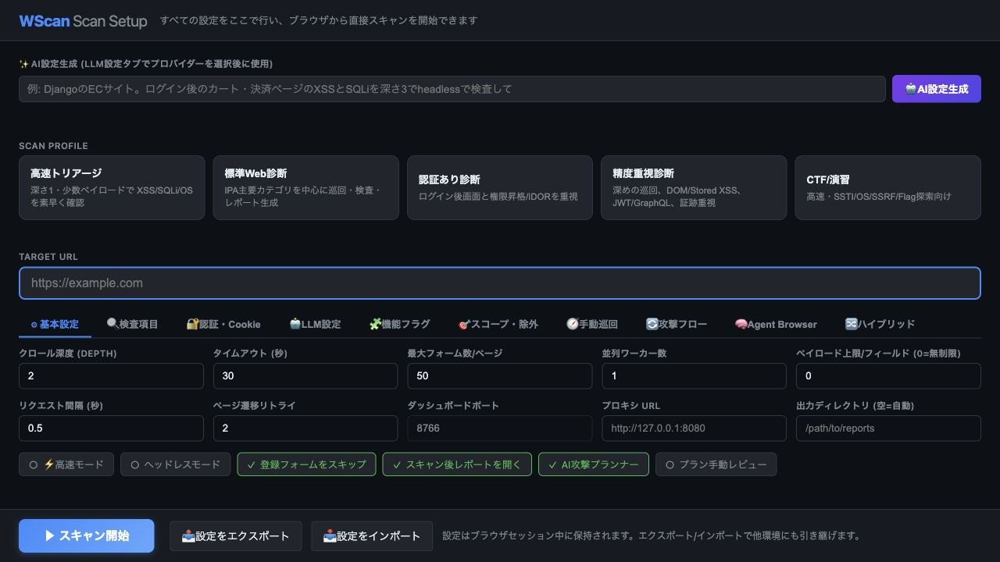
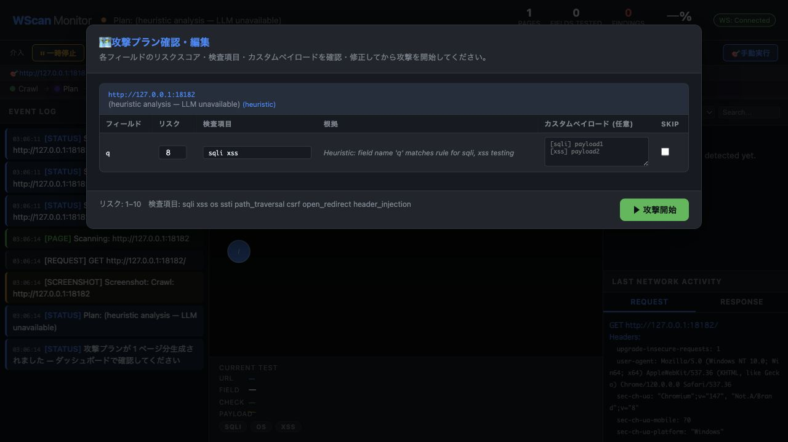

# WScan ダッシュボード利用ガイド

このガイドでは、WScan をコマンドラインから直接実行するのではなく、先にダッシュボードを起動して、ブラウザ上の入力フォームから検査を開始する手順を説明します。

スクリーンショットは、ローカルの疑似脆弱アプリ `http://127.0.0.1:18182` に対して実際に疑似検査を実行したものです。検査例では、検索パラメータ `q` に対する XSS が検出されています。

> 注意: WScan は脆弱性検査ツールです。自分が管理している環境、または検査許可を得た環境だけを対象にしてください。

実検査前のスコープ設計、認証、負荷調整、再検査の流れは [operation_guide_ja.md](operation_guide_ja.md) を参照してください。アクセス失敗や検出漏れの切り分けは [troubleshooting_ja.md](troubleshooting_ja.md) にまとめています。

## 1. 事前準備

リポジトリを取得し、Python 依存関係と Playwright ブラウザをインストールします。

```bash
git clone https://github.com/oudontabetai1-lab/AutoXSScheckTool.git
cd AutoXSScheckTool

pip install -r requirements.txt
playwright install chromium
```

Python 3.11 以上を推奨します。

## 2. ダッシュボードを起動する

まず、検査対象 URL を指定せずにダッシュボードだけを起動します。

```bash
python3 main.py serve --port 8765
```

起動後、ブラウザで次の URL を開きます。

```text
http://localhost:8765
```

ポート `8765` が使用中の場合は、別のポートを指定してください。

```bash
python3 main.py serve --port 8766
```



この画面が表示されたら、ダッシュボードから検査設定を入力できます。

## 3. 検査対象を入力する

「Target URL」に検査対象の URL を入力します。

今回の疑似検査では、ローカルの疑似脆弱アプリを対象にしています。

```text
http://127.0.0.1:18182
```


基本的な確認では、まず次の項目だけ設定すれば十分です。

| 項目 | 説明 | 初回の目安 |
| --- | --- | --- |
| Target URL | 検査対象のトップページ、ログイン後ページ、検索ページなど | 必須 |
| Scan Depth | クロールする深さ | `1` から開始 |
| Timeout | 1 ページやリクエストの待機時間 | 既定値で開始 |
| Max Forms | 1 ページ内で検査するフォーム数 | 既定値で開始 |
| Request Delay | リクエスト間隔 | 負荷を抑えるなら長め |
| Max Payloads | 1 フィールドに投入する最大ペイロード数 | まず少なめ |
| Navigation Retries | 画面遷移失敗時の再試行回数 | `1` 以上推奨 |
| クライアント証明書 | mTLS が必要な対象へ提示する証明書 | 必要な場合のみ |
| CA証明書バンドル | 社内CA/自己署名証明書を検証するCA | TLS検証時 |

最初は小さい範囲で試し、検査対象に問題がないことを確認してから深さやペイロード数を増やしてください。

## 4. スキャンプロファイルを選ぶ

画面上部のプリセットから、目的に近いプロファイルを選べます。

| プロファイル | 向いている用途 |
| --- | --- |
| 高速トリアージ | まず短時間でリスクを把握したい場合 |
| 標準Web診断 | 一般的な Web アプリ検査 |
| 認証あり診断 | ログインが必要な画面を検査する場合 |
| 精度重視診断 | SPA クロールや攻撃計画確認も含めて丁寧に見る場合 |
| CTF | CTF / 演習環境で SSTI、OS コマンド、SSRF、Flag 探索を重視する場合 |

通常の初回確認では「高速トリアージ」または「標準Web診断」から始めると扱いやすいです。

## 5. 必要に応じて詳細設定を行う

ダッシュボードには複数の設定タブがあります。

| タブ | 主な用途 |
| --- | --- |
| 基本設定 | 深さ、タイムアウト、ペイロード数、プロキシなどを設定 |
| チェック | XSS、SQLi、CSRF、CORS など検査種別を選択 |
| 認証・Cookie | ログイン URL、ユーザー名、パスワード、Cookie を設定 |
| スコープ | 検査対象外 URL、許可 URL、除外パラメータを設定 |
| 手動クロール | 事前に操作したページや URL を検査対象に追加 |
| Attack Flow | ログイン、カート投入、確認画面遷移など複数手順を定義 |

認証が必要なサイトでは、「認証・Cookie」タブでログイン情報または Cookie を設定します。ログアウト、削除、送信、決済など副作用の大きい URL は「スコープ」タブで除外してください。

ログイン後にワンタイムコード（2段階認証）を要求するサイトでは、同タブの「MFA (2段階認証) 自動入力」で MFA タイプ（TOTP / メール）を選ぶと、パスワード送信後のコード入力を自動化できます。コード取得は外部 MCP サーバ（mcp-totp-authenticator / mcp-email-server）に委譲し、シークレットやメール認証情報は環境変数（`TOTP_SECRET_*` / `MCP_EMAIL_SERVER_*` / `WSCAN_MFA_*`）で渡します。詳細は README の「MFA（2段階認証）付きログインの自動化」を参照してください。

Burp Suite や ZAP で通信を見たい場合は、基本設定の Proxy に次のようなプロキシを指定します。

```text
http://127.0.0.1:8080
```

mTLS が必要なサイトでは、基本設定にある「クライアント証明書 (PEM)」「クライアント秘密鍵 (PEM)」を指定します。PFX/PKCS#12 形式しかない場合は「クライアント証明書 (PFX/PKCS#12)」とパスフレーズを指定します。

社内CAや自己署名証明書を検証したい場合は「CA証明書バンドル」を指定し、「TLS証明書を検証」をオンにします。この設定は httpx による直接リクエストの検証に使われます。Playwright ブラウザ側は任意CAを直接指定できないため、従来通り HTTPS エラーを許容しながらクライアント証明書を提示します。

## 6. Scan Start を押す

設定を入力したら、画面下部の `Scan Start` を押します。

攻撃計画の確認が有効な場合は、すぐに攻撃は始まらず、検査対象フィールドと実行予定チェックを確認する画面が表示されます。



この画面では、フィールドごとの検査内容やペイロードを確認できます。不要な検査を外したり、対象外にしたいフィールドを除外してから、`攻撃開始` を押します。

## 7. 実行中の状態を確認する

検査中は、ダッシュボード上で進捗、現在のフェーズ、イベントログ、リクエスト、レスポンス、スクリーンショット、検出結果を確認できます。

主なフェーズは次の流れです。

```text
Crawl -> Plan -> Attack -> Report
```

`Attack` フェーズでは、フォームや URL パラメータに対して選択した検査が実行されます。アクセス失敗、タイムアウト、認証切れなどが起きた場合は、イベントログに表示されます。

## 8. 検出結果を見る

検査が進むと、右側の Findings や Event Log に検出結果が表示されます。


疑似検査では、`q` パラメータに対して XSS ペイロードを投入し、JavaScript の `alert()` 発火が確認されたため、`XSS CONFIRMED` として検出されています。

検出結果では、少なくとも次を確認してください。

| 確認ポイント | 見る内容 |
| --- | --- |
| Severity | 重要度。Critical / High は優先確認 |
| Type | XSS、SQLi、CSRF などの脆弱性種別 |
| URL | どのページで検出されたか |
| Field | どの入力欄、パラメータ、ヘッダで検出されたか |
| Evidence | alert 発火、レスポンス差分、ヘッダ変化などの証拠 |
| Request / Response | 実際に送信したリクエストと応答 |

ダッシュボード上だけで判断せず、証拠、再現手順、レポートも合わせて確認してください。

## 9. レポートと証跡を確認する

検査が完了すると、`output/<日時>/` 配下に結果が保存されます。

代表的な出力は次のとおりです。

| ファイル | 内容 |
| --- | --- |
| `report.html` | ブラウザで確認できる HTML レポート |
| `evidence.json` | Finding、リクエスト、レスポンスなどの証跡 |
| `reproduction.json` | 再現に必要な情報 |
| `reproduce.sh` | 再現用コマンド |
| `remediation_plan.md` | 修正方針や対応タスク |
| `report.sarif` | CI/CD やコードスキャン連携向け SARIF |

今回の疑似検査では、次のような出力ディレクトリが生成されました。

```text
output/20260519_030611/
```

HTML レポートは、検出結果を第三者に共有する場合や、修正後の再検査で差分を見る場合に使います。

## 10. よくあるつまずき

### 対象にアクセスできない

Target URL がブラウザから開けるか確認してください。社内環境、VPN、認証、IP 制限、自己署名証明書、プロキシ設定が原因になることがあります。

### ログイン後の画面を検査できない

「認証・Cookie」タブで Cookie を直接渡すか、ログイン URL、ユーザー名、パスワードを設定します。セッションが短時間で切れるサイトでは、Navigation Retries を増やし、ログに `Session expired` が出ていないか確認してください。

### SPA の画面が十分にクロールされない

「精度重視診断」または `SPA Crawl` を有効にします。クリック操作が必要な画面は、手動クロールや HAR インポートで対象 URL を補うと検査しやすくなります。

### 検出が少ない、または見逃しが疑われる

Max Payloads、Scan Depth、チェック種別、Attack Flow を増やして再検査します。WAF やレート制限がある環境では Request Delay を長くし、プロキシで通信内容を確認してください。

### 対象サイトに負荷をかけたくない

Scan Depth、Max Forms、Max Payloads、並列度を小さくし、Request Delay を長めに設定します。初回は検証環境やステージング環境で実行してください。

## 11. 最小手順まとめ

ダッシュボードから検査する最短手順は次のとおりです。

```bash
python3 main.py serve --port 8765
```

1. ブラウザで `http://localhost:8765` を開く。
2. `Target URL` に検査対象を入力する。
3. プロファイルを選ぶ。
4. 必要なら認証情報、Cookie、除外 URL を設定する。
5. `Scan Start` を押す。
6. 攻撃プランを確認して `攻撃開始` を押す。
7. Findings と `output/<日時>/report.html` を確認する。
